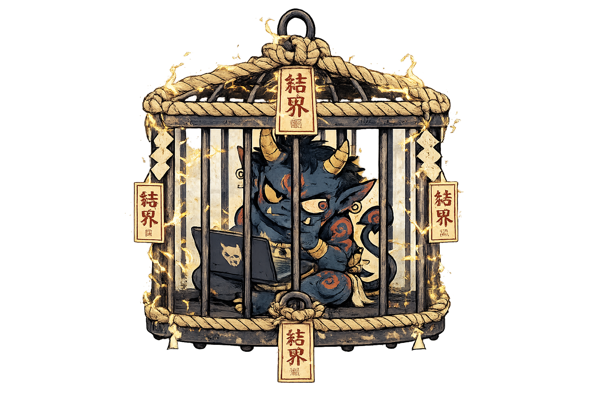

# Kekkai



> *Kekkai* (結界): a barrier/ward in Japanese folklore that confines spirits within a defined space.

Run Claude Code with confidence: a per-project sandbox with explicit control over disk, network, and secrets.

- [Why](#why)
- [What you get](#what-you-get)
- [Demo video](#demo-video)
- [Install](#install)
- [Usage](#usage)
- [Configure](#configure)
- [Known limitations](#known-limitations)

## Why

An autonomous AI agent with access to your entire disk, the full internet, and every secret on your machine is risky: a wrong command, prompt injection, or malicious code can all do damage. The blast radius is your laptop.

Kekkai confines it. With a restrictive sandbox as the security boundary, Claude Code can safely run off the leash with `--dangerously-skip-permissions` - fully autonomous, no interruptions.

## What you get

`kekkai up` spins up the latest Claude Code inside a Docker container locked to the current folder, designed so nothing escapes it.

A `.kekkai.yaml` file in the project folder lets you define:

- **Disk**: which folders to expose
- **Network**: which outgoing traffic to allow
- **Secrets**: which sensitive files to hide

Your Claude setup carries over into the sandbox: skills, hooks, sessions - everything in `~/.claude` - so it behaves exactly like your regular Claude Code, just contained.

## Demo video

https://github.com/user-attachments/assets/64bfe8d3-e153-49d1-9485-3816f4b3b417


## Install

Kekkai ships as a single static binary, installed to `~/.local/bin`.

**Prerequisites:** Linux x86_64/aarch64, or macOS on Apple silicon. Docker (on macOS: Docker Desktop, OrbStack, colima, or any Docker-compatible runtime), git, curl.

Quick install:

```sh
curl -fsSL https://raw.githubusercontent.com/filidorwiese/kekkai/main/install.sh | bash
```

Make sure `~/.local/bin` is on your PATH.

Or manually grab a binary directly from the [releases page](https://github.com/filidorwiese/kekkai/releases) and drop it in your PATH.

## Usage

From your project folder:

```sh
kekkai init        # writes a starter .kekkai.yaml
kekkai up          # builds the sandbox and drops you into Claude Code
kekkai down        # stops and removes the sandbox for this folder
kekkai shell       # opens zsh in the running sandbox
kekkai exec        # runs a one-off command in the running sandbox
kekkai traffic     # streams live dns lookups/egress traffic, labeled ALLOW/BLOCK
kekkai ps          # lists running kekkai containers
kekkai prune       # removes orphans (containers, images)
kekkai self-update # updates kekkai to the latest release
kekkai version     # prints version
```
`kekkai up` applies your `.kekkai.yaml`, locks the sandbox to the current folder, and starts Claude Code inside it. The config file is optional - without one, kekkai runs on the baked-in defaults, which are intentionally restrictive.

## Configure

To customize the sandbox, generate a commented starter configuration with `kekkai init`. All blocks are optional - uncomment to alter.

A full working example:

```yaml
image:
  # Node.js version: "lts" (default), "current", or a version like "24".
  node_version: lts
  apt_packages: [golang]

claude:
  # Claude Code version: "latest" (default) or pin e.g. "2.0.14"
  # for reproducible agent behavior. "latest" tracks new releases -
  # the sandbox image rebuilds automatically when one ships.
  version: latest
  # Arguments to claude. This string replaces the default - keep
  # --dangerously-skip-permissions if you want autonomous mode
  # (the sandbox is the security boundary, so prompts are skipped).
  # Append extras as needed, e.g. "--model claude-sonnet-5".
  args: "--dangerously-skip-permissions"

git:
  # true: mounts ~/.gitconfig (readonly) - your identity and settings;
  # the agent can create local commits.
  # false (or section omitted): .git is mounted readonly - the agent
  # can read history (log, diff, show) but not commit or rewrite it.
  enabled: true
  # Exposes your SSH agent ($SSH_AUTH_SOCK) and allowed_signers file:
  # enables SSH commit signing and push/pull to allowed hosts.
  # Off by default - the agent can then act with all your loaded keys.
  # Requires git.enabled: true.
  ssh_agent: false

env:
  NODE_ENV: development
  # Github CLI auth: pass your token through
  GH_TOKEN: ${GH_TOKEN}
  # Pass any Claude flag: https://code.claude.com/docs/en/env-vars
  CLAUDE_CODE_NEW_INIT: 1

disk:
  mounts:
    # target is optional: ~/foo lands at ~/foo in the sandbox,
    # other absolute paths at the same path
    - source: ~/.aws
      readonly: true
      optional: true   # skip silently if source doesn't exist

network:
  # api.anthropic.com (required by Claude Code) is always
  # allowed and doesn't need to be listed

  # Escape hatch: disables the egress firewall entirely - the agent
  # can reach any destination. Can't be combined with the options
  # below. When the network block is omitted, the firewall stays on
  # with only the builtin hosts allowed.
  allow_all: false

  # Allow GitHub (git, api, ssh) - egress IPs are resolved
  # automatically from api.github.com/meta at startup
  allow_github: false

  # IP ranges, e.g. your LAN (router, NAS) or a staging environment
  allowed_cidrs:
    - 192.168.1.0/24

  # Domains are resolved to IPs once, at sandbox startup
  allowed_domains:
    - registry.npmjs.org
    - proxy.golang.org
    - sum.golang.org

secrets:
  # Files or directories shadowed with empty mounts, paths relative
  # to project root. Exact paths only; missing paths are skipped
  # with a warning.
  hide:
    - .env.production
    - deploy/certs

# CPU/memory caps for the sandbox; unlimited when omitted
limits:
  cpus: 4
  memory: 8g
```


## Known limitations

Kekkai protects against a misbehaving agent: prompt injection, malicious dependencies, destructive commands. But no sandbox can be 100% safe and still be useful.

Know the trade-offs you're making:

- Your Claude Code credentials must live inside the sandbox. Also, egress traffic to api.anthropic.com is always allowed. Both are necessary for Claude to function. Claude telemetry is disabled inside the sandbox.
- Any allowed network destination could be used for exfiltration - allow domains sparingly. DNS lookups are unrestricted, so they're potentially a side channel too.
- Secrets hiding is an explicit list: only the exact files/directories you name are shadowed. Anything else in mounted folders is readable. Keep secrets out of the project folder where you can.
- `~/.claude` is shared read-write so sessions persist - a compromised agent could alter hooks or skills you later run outside the sandbox. Review changes there as you would code.
- `git.ssh_agent: true` exposes your SSH agent to the sandbox: the agent can sign, push, and authenticate as you against any allowed network destination. Enable per-project, deliberately.
- Docker CLI inside the sandbox isn't supported: giving the agent access to the Docker socket would bypass the sandbox entirely.
- The Docker bridge subnet is always reachable: host services listening on `0.0.0.0` or the bridge IP, and neighbor containers on the same bridge, are exposed to the sandbox.
- Docker is the boundary: kernel-level container escapes are out of scope.
- macOS: shared-folder I/O is slower than native Linux binds.
- macOS: the sandbox can reach Mac services via `host.docker.internal`, including those bound to localhost.
- macOS: `git.ssh_agent` needs the runtime to forward the agent into its VM (colima: start with `--ssh-agent`).
