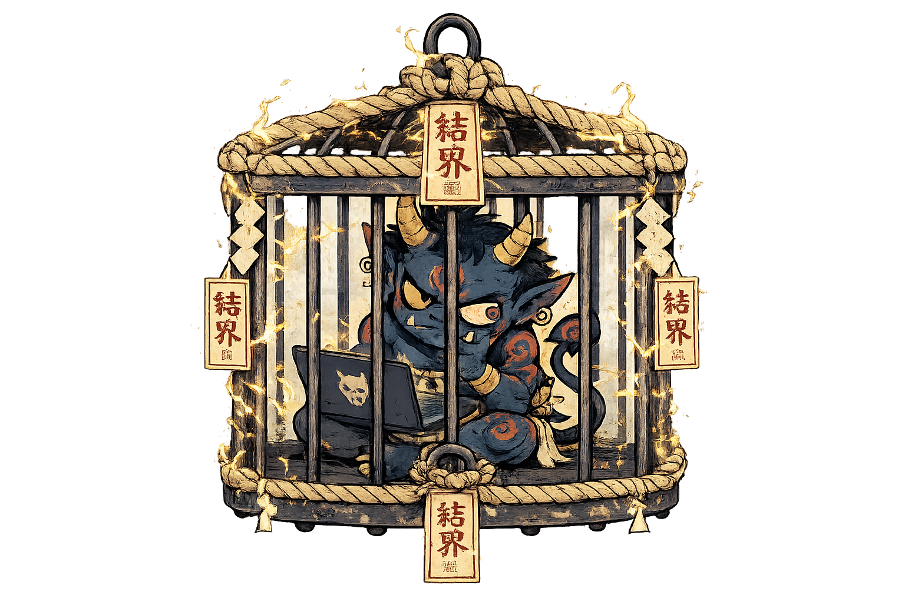

# Kekkai



> *Kekkai* (結界): a barrier/ward in Japanese folklore that confines spirits within a defined space.

Run Claude Code with confidence: a per-project sandbox with explicit control over disk, network, and secrets.

- [Why](#why)
- [What you get](#what-you-get)
- [Demo video](#demo-video)
- [Install](#install)
- [Usage](#usage)
- [Configure](#configure)
- [Known limitations](#known-limitations)

## Why

An autonomous AI agent with access to your entire disk, the full internet, and every secret on your machine is risky: a wrong command, prompt injection, or malicious code can all do damage. The blast radius is your laptop.

Kekkai confines it. With a restrictive sandbox as the security boundary, Claude Code can safely run off the leash with `--dangerously-skip-permissions` - fully autonomous, no interruptions.

The whole boundary is declarative and lives with the code. One yaml in the project root defines which volumes are mounted and whether they're readonly, which egress is allowed, and which secrets are shadowed with empty mounts. It's versioned with the repo, so the sandbox is reproducible, reviewable, and scoped to what that one project actually needs.

## What you get

`kekkai up` starts the latest Claude Code in a locked-down, Docker-based sandbox. It only has access to the current folder and your `~/.claude`, and reaches nothing on the network except the Claude API. Skills, hooks, plugins and sessions carry over between host and sandbox.

An optional `.kekkai.yaml` in the project folder lets you define:

- **Disk**: which folders to expose
- **Network**: which egress traffic to allow
- **Secrets**: which sensitive files to hide

Kekkai let's Claude Code run unattended safely (within the [known limitations](#known-limitations)).

## Demo video


https://github.com/user-attachments/assets/0dc8b011-edb9-4b54-a69b-e1b59ad8f183


## Install

Kekkai ships as a single static binary, installed to `~/.local/bin` (size: ~3MB).

**Prerequisites:** Linux x86_64/aarch64, or macOS on Apple silicon. Docker and curl.

Quick install:

```sh
curl -fsSL https://raw.githubusercontent.com/filidorwiese/kekkai/main/install.sh | bash
```

Make sure `~/.local/bin` is on your PATH.

Or manually grab a binary directly from the [releases page](https://github.com/filidorwiese/kekkai/releases) and drop it in your PATH.

## Usage

From your project folder:

```sh
kekkai init        # writes a starter .kekkai.yaml
kekkai up          # builds the sandbox and drops you into Claude Code
kekkai down        # stops and removes the sandbox for this folder
kekkai shell       # opens bash in the running sandbox
kekkai exec        # runs a one-off command in the running sandbox
kekkai traffic     # logs dns lookups and tcp connections being made (labeled ALLOW/BLOCK)
kekkai mpr         # logs the full content of every request/response between Claude and the model provider
kekkai ps          # lists running kekkai containers
kekkai prune       # removes orphans (containers, images)
kekkai self-update # updates kekkai to the latest release
kekkai version     # prints version
```
`kekkai up` applies your `.kekkai.yaml`, locks the sandbox to the current folder, and starts Claude Code inside it. The config file is optional - without one, kekkai runs on the baked-in defaults, which are intentionally restrictive.

Run `kekkai traffic` or `kekkai mpr` in a second terminal to attach to the running sandbox.
- `traffic` shows *where* the sandbox connects (useful to fine-tune the sandbox egress firewall)
- `mpr` shows *what* Claude sends to and receives from the model provider (useful to inspect and fine-tune your agent context).

## Configure
Kekkai works without any config. Run `kekkai up` in a project folder and you get the baked-in defaults: the project folder mounted, egress denied except `api.anthropic.com`, nothing else exposed. That's a usable sandbox for most work, and you should only add a config when it's too restrictive.

To customize the sandbox, run `kekkai init` to generate a commented starter file where everything is commented out. All blocks are optional, uncomment only what you need. Remember to restart Kekkai after making changes to the configuration for it to take effect.

The full set of options for reference:

```yaml
image:
  # Node.js version, installed at image build time: "lts" (default) or a
  # version number like "22", "22.11" or "22.11.0".
  node_version: lts
  # python3 + pip come preinstalled; apt_packages appends extras,
  # e.g. python libraries from Debian:
  apt_packages: [python3-requests, python3-numpy]

  # Custom apt repositories for apt_packages to install from.
  # urls must be https. Omit key_url when Debian already ships
  # the signing key (e.g. backports).
  apt_repos:
    - name: backports
      url: https://deb.debian.org/debian
      suite: trixie-backports
      components: main

claude:
  # Claude Code version: "latest" (default) or pin e.g. "2.0.14"
  # for reproducible agent behavior. "latest" tracks new releases -
  # the sandbox image rebuilds automatically when one ships.
  version: latest
  # Arguments to claude. This string replaces the default - keep
  # --dangerously-skip-permissions if you want autonomous mode
  # (the sandbox is the security boundary, so prompts are skipped).
  # Append extras as needed, e.g. "--model claude-sonnet-5".
  args: "--dangerously-skip-permissions"

git:
  # true: mounts ~/.gitconfig (readonly) - your identity and settings;
  # the agent can create local commits.
  # false (or section omitted): .git is mounted readonly - the agent
  # can read history (log, diff, show) but not commit or rewrite it.
  enabled: true
  # Exposes your SSH agent ($SSH_AUTH_SOCK) and allowed_signers file:
  # enables SSH commit signing and push/pull to allowed hosts.
  # Off by default - the agent can then act with all your loaded keys.
  # Requires git.enabled: true.
  ssh_agent: false

env:
  NODE_ENV: development
  # Github CLI auth: pass your token through
  GH_TOKEN: ${GH_TOKEN}
  # Pass any Claude flag: https://code.claude.com/docs/en/env-vars
  CLAUDE_CODE_NEW_INIT: 1

disk:
  mounts:
    # target is optional: ~/foo lands at ~/foo in the sandbox,
    # other absolute paths at the same path
    - source: ~/.aws
      readonly: true
      optional: true   # skip silently if source doesn't exist

network:
  # api.anthropic.com (required by Claude Code) is always
  # allowed and doesn't need to be listed

  # Escape hatch: disables the egress firewall entirely - the agent
  # can reach any destination. Can't be combined with the options
  # below. When the network block is omitted, the firewall stays on
  # with only the builtin hosts allowed.
  allow_all: false

  # Allow GitHub (git, api, ssh) - egress IPs are resolved
  # automatically from api.github.com/meta at startup
  allow_github: false

  # IP ranges, e.g. your LAN (router, NAS) or a staging environment
  allowed_cidrs:
    - 192.168.1.0/24

  # Allowed egress domains, resolved to IPs at sandbox startup.
  # Example: the python and npm package registries:
  allowed_domains:
    - pypi.org
    - files.pythonhosted.org
    - registry.npmjs.org

secrets:
  # Files or directories shadowed with empty mounts, paths relative
  # to project root. Exact paths only; missing paths are skipped
  # with a warning.
  hide:
    - .env.production
    - deploy/certs

# CPU/memory caps for the sandbox; unlimited when omitted
limits:
  cpus: 4
  memory: 8g
```


## Known limitations

Kekkai protects against a misbehaving agent: prompt injection, malicious dependencies, destructive commands. But no sandbox can be 100% safe and still be useful.

Know the trade-offs you're making:

- Docker is the boundary: kernel-level container escapes are out of scope.
- Docker CLI inside the sandbox isn't supported: giving the agent access to the Docker socket would bypass the sandbox entirely.
- Your Claude Code credentials must live inside the sandbox. Also, egress traffic to api.anthropic.com is always allowed. Both are necessary for Claude to function. Claude telemetry is disabled inside the sandbox.
- Any allowed network destination could be used for exfiltration - allow domains sparingly. DNS lookups are unrestricted, so they're potentially a side channel too.
- Your Claude config dir (`~/.claude` or `$CLAUDE_CONFIG_DIR`) is shared read-write at its host path so sessions persist - a compromised agent could alter hooks, skills or plugins you later run outside the sandbox. Review changes there as you would code.
- Secrets hiding is an explicit list: only the exact files/directories you name are shadowed. Anything else in mounted folders is readable. Keep secrets out of the project folder where you can.
- The Docker bridge subnet is always reachable: host services listening on `0.0.0.0` or the bridge IP, and neighbor containers on the same bridge, are exposed to the sandbox.
- `git.ssh_agent: true` exposes your SSH agent to the sandbox: the agent can sign, push, and authenticate as you against any allowed network destination. Enable per-project, deliberately.
- macOS: the sandbox can reach Mac services via `host.docker.internal`, including those bound to localhost.
- macOS: `git.ssh_agent` needs the runtime to forward the agent into its VM (colima: start with `--ssh-agent`).
- macOS: shared-folder I/O is slower than native Linux binds.
- `kekkai mpr` sees only traffic that honors `ANTHROPIC_BASE_URL` (the Claude API); provider routes that ignore it are not captured. The captured stream is readable by processes inside the sandbox, i.e. by the agent itself - it is the agent's own outbound data, never your credentials (headers are not captured).
